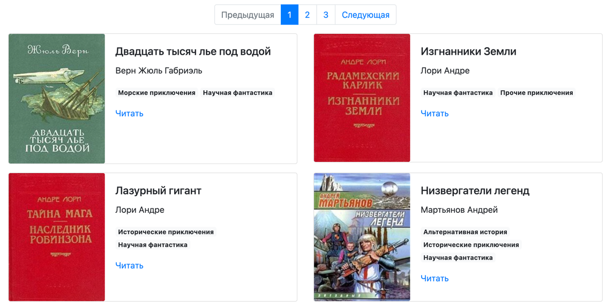

# Book parser tutulu.org

Program downloads books from https://tululu.org/

[Check out the demo version of the site: ](https://michael-zapivahin.github.io/library_parsing/pages/index1.html)

## Easy start:

Download [archive.zip](archive.zip) and open the file `index.html`.

## It's look like as:




## How to install

Python3 should already be installed. 
Use pip or pip3, if there is a conflict with Python2) to install dependencies:

```
pip install -r requirements.txt
```

## Program uses an environment variable

#### Variables:

`BOOKS_DIR` folder for saving your books, `default='books'`

`IMAGES_DIR` folder for saving your pictures, `default='images'`

`COMMENTS_DIR` folder for saving book's comment `default='comments'`

### How to start

```
python main.py --start_page 0 --end_page 2

```

### Here is some examples:
```
python3 parse_tululu_category.py --start_page 301 --end_page 303 --dest_folder ~/fantastic_books

python3 parse_tululu_category.py --start_page 700 --dest_folder ~/fantastic_books --json_path ~/fantastic_books/json_folder/data.json --skip_imgs

python3 parse_tululu_category.py --end_page 4 --skip_imgs --skip_txt --json_path ~/path/to/json/folder/books.json
```

### Commands' line parameters:

'--start_page' page's number starting from which the script will begin to fetch the books.

'--end_page' page's number for ending.

'--skip_imgs' argument turn off book covers download if 'True' is specified

'--skip_txt' argument turn off book texts download if 'True' is specified

'--dest_folder' argument changes the books download destination folder

'--json_path' argument changes the JSON file destination folder

## The aim of the project 
The code is written for educational purposes on the online course for web developers [Devman практика Python](https://dvmn.org/)

